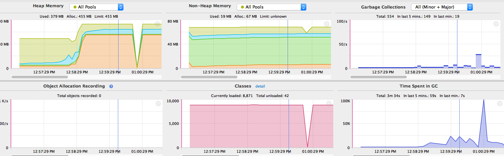
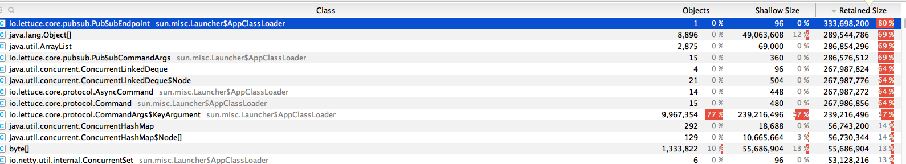
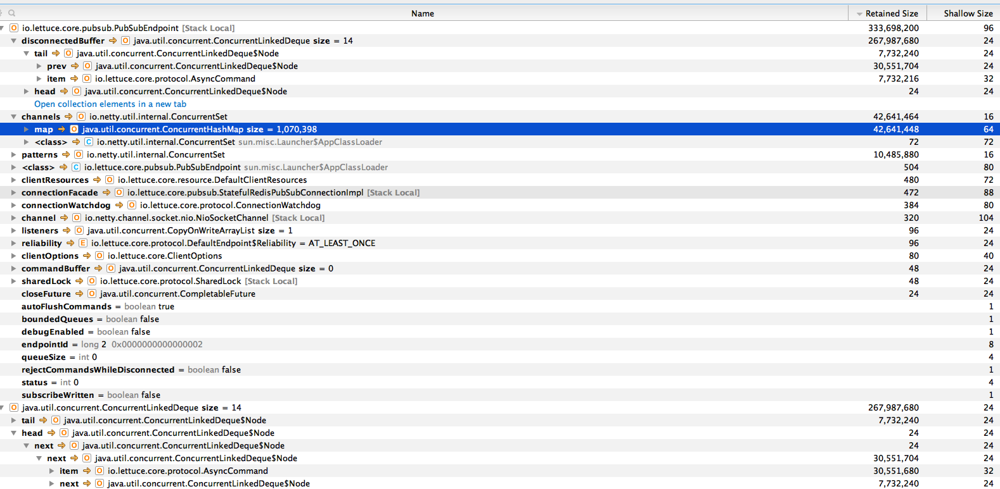

Spring Session Redis Lettuce Memory Issue
=========================================

Problem Description
-------------------

When using spring-boot 2 (we've seen it in 2.0.6 and 2.1.0) with spring-session backed by spring-data-redis backed by lettuce,
we see application crashes due to out-of-memory problems. These issues seem to be triggered by reconnection attempts.
Those in turn seem to be due to our configuration of haproxy timeouts (2 hours of inactivity).

The issue is reproducable using the setup in this readme and only requires the simplest of spring boot applications, and a
docker-based haproxy / redis configuration. 

This issue will describe the reproduction path of the example application.

Setup
-----

In spring initializr (https://start.spring.io/) create a project with the session, redis and web modules. Or use the lettuce-memory-leak-demo-app
project contained here.

Get an haproxy/redis setup from https://github.com/arhea/docker-redis , or use the copy contained in haproxy-redis. It can be started 
with docker-compose up -d . This setup has very short timeouts, which is handy for reproduction. 

With the redis setup started, start the application: mvn spring-boot:run -Dspring-boot.run.jvmArguments="-Xmx512m" .
The smaller memory is to trigger the issue sooner (about 2 minutes on my machine); but also happens with larger heaps.

As an illustration of what happens I have made some screenshots of YourKit attached to this demo application. The issue occurs around 12:59:20.
The interesting part is that the ps old gen pool (orange) increases very fast, and that the PubSubEndpoint has a huge retained size, and that there are many KeyArguments in memory.

As it can be seen there is quite a lot of memory used by lettuce. 

Stack Traces with Lettuce
-------------------------

The application generates errors, but recovers. Logging shows:

	2018-11-02 12:56:39.204  INFO 3031 --- [xecutorLoop-1-2] i.l.core.protocol.ConnectionWatchdog     : Reconnecting, last destination was localhost/127.0.0.1:6379
	2018-11-02 12:56:39.209  INFO 3031 --- [ioEventLoop-4-4] i.l.core.protocol.ReconnectionHandler    : Reconnected to localhost:6379
	2018-11-02 12:56:44.800  INFO 3031 --- [xecutorLoop-1-3] i.l.core.protocol.ConnectionWatchdog     : Reconnecting, last destination was localhost/127.0.0.1:6379
	2018-11-02 12:56:44.805  INFO 3031 --- [ioEventLoop-4-5] i.l.core.protocol.ReconnectionHandler    : Reconnected to localhost:6379

But at some point:

	2018-11-02 12:59:20.227  INFO 3031 --- [xecutorLoop-1-3] i.l.core.protocol.ConnectionWatchdog     : Reconnecting, last destination was localhost/127.0.0.1:6379
	2018-11-02 12:59:20.238  INFO 3031 --- [ioEventLoop-4-5] i.l.core.protocol.ReconnectionHandler    : Reconnected to localhost:6379
	2018-11-02 12:59:20.248 ERROR 3031 --- [Engine[Tomcat]]] org.apache.catalina.core.ContainerBase   : Unexpected death of background thread [ContainerBackgroundProcessor[StandardEngine[Tomcat]]]

	java.lang.OutOfMemoryError: GC overhead limit exceeded
		at java.util.ArrayList.iterator(ArrayList.java:840) ~[na:1.8.0_171]
		at org.apache.catalina.webresources.StandardRoot.gc(StandardRoot.java:614) ~[tomcat-embed-core-9.0.12.jar:9.0.12]
		at org.apache.catalina.webresources.StandardRoot.backgroundProcess(StandardRoot.java:606) ~[tomcat-embed-core-9.0.12.jar:9.0.12]
		at org.apache.catalina.core.StandardContext.backgroundProcess(StandardContext.java:5484) ~[tomcat-embed-core-9.0.12.jar:9.0.12]
		at org.apache.catalina.core.ContainerBase$ContainerBackgroundProcessor.processChildren(ContainerBase.java:1398) ~[tomcat-embed-core-9.0.12.jar:9.0.12]
		at org.apache.catalina.core.ContainerBase$ContainerBackgroundProcessor.processChildren(ContainerBase.java:1402) ~[tomcat-embed-core-9.0.12.jar:9.0.12]
		at org.apache.catalina.core.ContainerBase$ContainerBackgroundProcessor.processChildren(ContainerBase.java:1402) ~[tomcat-embed-core-9.0.12.jar:9.0.12]
		at org.apache.catalina.core.ContainerBase$ContainerBackgroundProcessor.run(ContainerBase.java:1370) ~[tomcat-embed-core-9.0.12.jar:9.0.12]
		at java.lang.Thread.run(Thread.java:747) [na:1.8.0_171]

	Exception in thread "ContainerBackgroundProcessor[StandardEngine[Tomcat]]" 2018-11-02 12:59:20.248  WARN 3031 --- [ioEventLoop-4-3] io.lettuce.core.protocol.CommandHandler  : null Unexpected exception during request: java.lang.OutOfMemoryError: GC overhead limit exceeded

	java.lang.OutOfMemoryError: GC overhead limit exceeded
		at io.lettuce.core.protocol.CommandArgs$KeyArgument.of(CommandArgs.java:646) ~[lettuce-core-5.1.2.RELEASE.jar:na]
		at io.lettuce.core.protocol.CommandArgs.addKey(CommandArgs.java:81) ~[lettuce-core-5.1.2.RELEASE.jar:na]
		at io.lettuce.core.protocol.CommandArgs.addKeys(CommandArgs.java:113) ~[lettuce-core-5.1.2.RELEASE.jar:na]
		at io.lettuce.core.pubsub.PubSubCommandBuilder.pubSubCommand(PubSubCommandBuilder.java:94) ~[lettuce-core-5.1.2.RELEASE.jar:na]
		at io.lettuce.core.pubsub.PubSubCommandBuilder.subscribe(PubSubCommandBuilder.java:85) ~[lettuce-core-5.1.2.RELEASE.jar:na]
		at io.lettuce.core.pubsub.RedisPubSubAsyncCommandsImpl.subscribe(RedisPubSubAsyncCommandsImpl.java:64) ~[lettuce-core-5.1.2.RELEASE.jar:na]
		at io.lettuce.core.pubsub.StatefulRedisPubSubConnectionImpl.resubscribe(StatefulRedisPubSubConnectionImpl.java:124) ~[lettuce-core-5.1.2.RELEASE.jar:na]
		at io.lettuce.core.pubsub.StatefulRedisPubSubConnectionImpl.activated(StatefulRedisPubSubConnectionImpl.java:144) ~[lettuce-core-5.1.2.RELEASE.jar:na]
		at io.lettuce.core.protocol.DefaultEndpoint.lambda$notifyChannelActive$0(DefaultEndpoint.java:379) ~[lettuce-core-5.1.2.RELEASE.jar:na]
		at io.lettuce.core.protocol.DefaultEndpoint$$Lambda$497/563999734.run(Unknown Source) ~[na:na]
		at io.lettuce.core.protocol.SharedLock.lambda$doExclusive$0(SharedLock.java:82) ~[lettuce-core-5.1.2.RELEASE.jar:na]
		at io.lettuce.core.protocol.SharedLock$$Lambda$498/986831488.get(Unknown Source) ~[na:na]
		at io.lettuce.core.protocol.SharedLock.doExclusive(SharedLock.java:103) ~[lettuce-core-5.1.2.RELEASE.jar:na]
		at io.lettuce.core.protocol.SharedLock.doExclusive(SharedLock.java:81) ~[lettuce-core-5.1.2.RELEASE.jar:na]
		at io.lettuce.core.protocol.DefaultEndpoint.notifyChannelActive(DefaultEndpoint.java:363) ~[lettuce-core-5.1.2.RELEASE.jar:na]
		at io.lettuce.core.pubsub.PubSubEndpoint.notifyChannelActive(PubSubEndpoint.java:108) ~[lettuce-core-5.1.2.RELEASE.jar:na]
		at io.lettuce.core.protocol.CommandHandler.channelActive(CommandHandler.java:268) ~[lettuce-core-5.1.2.RELEASE.jar:na]
		at io.netty.channel.AbstractChannelHandlerContext.invokeChannelActive(AbstractChannelHandlerContext.java:213) ~[netty-transport-4.1.29.Final.jar:4.1.29.Final]
		at io.netty.channel.AbstractChannelHandlerContext.invokeChannelActive(AbstractChannelHandlerContext.java:199) ~[netty-transport-4.1.29.Final.jar:4.1.29.Final]
		at io.netty.channel.AbstractChannelHandlerContext.fireChannelActive(AbstractChannelHandlerContext.java:192) ~[netty-transport-4.1.29.Final.jar:4.1.29.Final]
		at io.netty.channel.ChannelInboundHandlerAdapter.channelActive(ChannelInboundHandlerAdapter.java:64) ~[netty-transport-4.1.29.Final.jar:4.1.29.Final]
		at io.lettuce.core.ChannelGroupListener.channelActive(ChannelGroupListener.java:40) ~[lettuce-core-5.1.2.RELEASE.jar:na]
		at io.netty.channel.AbstractChannelHandlerContext.invokeChannelActive(AbstractChannelHandlerContext.java:213) ~[netty-transport-4.1.29.Final.jar:4.1.29.Final]
		at io.netty.channel.AbstractChannelHandlerContext.invokeChannelActive(AbstractChannelHandlerContext.java:199) ~[netty-transport-4.1.29.Final.jar:4.1.29.Final]
		at io.netty.channel.AbstractChannelHandlerContext.fireChannelActive(AbstractChannelHandlerContext.java:192) ~[netty-transport-4.1.29.Final.jar:4.1.29.Final]
		at io.netty.channel.ChannelInboundHandlerAdapter.channelActive(ChannelInboundHandlerAdapter.java:64) ~[netty-transport-4.1.29.Final.jar:4.1.29.Final]
		at io.lettuce.core.PlainChannelInitializer$1.channelActive(PlainChannelInitializer.java:109) ~[lettuce-core-5.1.2.RELEASE.jar:na]
		at io.netty.channel.AbstractChannelHandlerContext.invokeChannelActive(AbstractChannelHandlerContext.java:213) ~[netty-transport-4.1.29.Final.jar:4.1.29.Final]
		at io.netty.channel.AbstractChannelHandlerContext.invokeChannelActive(AbstractChannelHandlerContext.java:199) ~[netty-transport-4.1.29.Final.jar:4.1.29.Final]
		at io.netty.channel.AbstractChannelHandlerContext.fireChannelActive(AbstractChannelHandlerContext.java:192) ~[netty-transport-4.1.29.Final.jar:4.1.29.Final]
		at io.netty.channel.DefaultChannelPipeline$HeadContext.channelActive(DefaultChannelPipeline.java:1422) ~[netty-transport-4.1.29.Final.jar:4.1.29.Final]
		at io.netty.channel.AbstractChannelHandlerContext.invokeChannelActive(AbstractChannelHandlerContext.java:213) ~[netty-transport-4.1.29.Final.jar:4.1.29.Final]

	java.lang.OutOfMemoryError: GC overhead limit exceeded
		at java.util.ArrayList.iterator(ArrayList.java:840)
		at org.apache.catalina.webresources.StandardRoot.gc(StandardRoot.java:614)
		at org.apache.catalina.webresources.StandardRoot.backgroundProcess(StandardRoot.java:606)
		at org.apache.catalina.core.StandardContext.backgroundProcess(StandardContext.java:5484)
		at org.apache.catalina.core.ContainerBase$ContainerBackgroundProcessor.processChildren(ContainerBase.java:1398)
		at org.apache.catalina.core.ContainerBase$ContainerBackgroundProcessor.processChildren(ContainerBase.java:1402)
		at org.apache.catalina.core.ContainerBase$ContainerBackgroundProcessor.processChildren(ContainerBase.java:1402)
		at org.apache.catalina.core.ContainerBase$ContainerBackgroundProcessor.run(ContainerBase.java:1370)
		at java.lang.Thread.run(Thread.java:747)
	2018-11-02 12:59:20.250  WARN 3031 --- [ioEventLoop-4-3] i.l.core.protocol.ConnectionWatchdog     : Cannot reconnect: io.lettuce.core.RedisConnectionException: Connection closed prematurely

	io.lettuce.core.RedisConnectionException: Connection closed prematurely
		at io.lettuce.core.PlainChannelInitializer$1.channelInactive(PlainChannelInitializer.java:80) ~[lettuce-core-5.1.2.RELEASE.jar:na]
		at io.netty.channel.AbstractChannelHandlerContext.invokeChannelInactive(AbstractChannelHandlerContext.java:245) ~[netty-transport-4.1.29.Final.jar:4.1.29.Final]
		at io.netty.channel.AbstractChannelHandlerContext.invokeChannelInactive(AbstractChannelHandlerContext.java:231) ~[netty-transport-4.1.29.Final.jar:4.1.29.Final]
		at io.netty.channel.AbstractChannelHandlerContext.fireChannelInactive(AbstractChannelHandlerContext.java:224) ~[netty-transport-4.1.29.Final.jar:4.1.29.Final]
		at io.netty.channel.DefaultChannelPipeline$HeadContext.channelInactive(DefaultChannelPipeline.java:1429) ~[netty-transport-4.1.29.Final.jar:4.1.29.Final]
		at io.netty.channel.AbstractChannelHandlerContext.invokeChannelInactive(AbstractChannelHandlerContext.java:245) ~[netty-transport-4.1.29.Final.jar:4.1.29.Final]
		at io.netty.channel.AbstractChannelHandlerContext.invokeChannelInactive(AbstractChannelHandlerContext.java:231) ~[netty-transport-4.1.29.Final.jar:4.1.29.Final]
		at io.netty.channel.DefaultChannelPipeline.fireChannelInactive(DefaultChannelPipeline.java:947) ~[netty-transport-4.1.29.Final.jar:4.1.29.Final]
		at io.netty.channel.AbstractChannel$AbstractUnsafe$8.run(AbstractChannel.java:822) ~[netty-transport-4.1.29.Final.jar:4.1.29.Final]
		at io.netty.util.concurrent.AbstractEventExecutor.safeExecute(AbstractEventExecutor.java:163) ~[netty-common-4.1.29.Final.jar:4.1.29.Final]
		at io.netty.util.concurrent.SingleThreadEventExecutor.runAllTasks(SingleThreadEventExecutor.java:404) ~[netty-common-4.1.29.Final.jar:4.1.29.Final]
		at io.netty.channel.nio.NioEventLoop.run(NioEventLoop.java:446) ~[netty-transport-4.1.29.Final.jar:4.1.29.Final]
		at io.netty.util.concurrent.SingleThreadEventExecutor$5.run(SingleThreadEventExecutor.java:884) ~[netty-common-4.1.29.Final.jar:4.1.29.Final]
		at io.netty.util.concurrent.FastThreadLocalRunnable.run(FastThreadLocalRunnable.java:30) ~[netty-common-4.1.29.Final.jar:4.1.29.Final]
		at java.lang.Thread.run(Thread.java:748) ~[na:1.8.0_171]

	2018-11-02 12:59:20.297  INFO 3031 --- [xecutorLoop-1-4] i.l.core.protocol.ConnectionWatchdog     : Reconnecting, last destination was localhost:6379

Stack Traces with Jedis
-----------------------

The system does not like unstable connections, but memory, especially old gen, is not affected. The application is stable and recovering.
This to me seems appropriate behaviour.

	2018-11-02 12:54:05.333  WARN 2797 --- [erContainer-225] o.s.d.r.l.RedisMessageListenerContainer  : Error closing subscription connection

	org.springframework.data.redis.RedisConnectionFailureException: Unexpected end of stream.; nested exception is redis.clients.jedis.exceptions.JedisConnectionException: Unexpected end of stream.
		at org.springframework.data.redis.connection.jedis.JedisExceptionConverter.convert(JedisExceptionConverter.java:67) ~[spring-data-redis-2.1.2.RELEASE.jar:2.1.2.RELEASE]
		...
		at java.lang.Thread.run(Thread.java:748) [na:1.8.0_171]
	Caused by: redis.clients.jedis.exceptions.JedisConnectionException: Unexpected end of stream.
		at redis.clients.util.RedisInputStream.ensureFill(RedisInputStream.java:199) ~[jedis-2.9.0.jar:na]
		...

	2018-11-02 12:54:05.333 ERROR 2797 --- [erContainer-225] o.s.d.r.l.RedisMessageListenerContainer  : Connection failure occurred. Restarting subscription task after 5000 ms